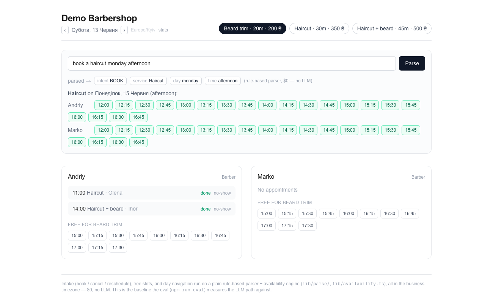
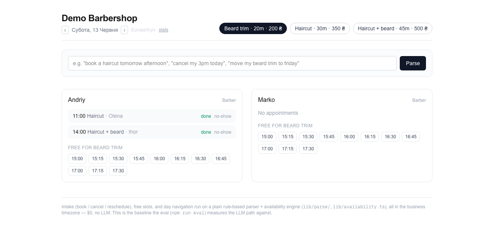
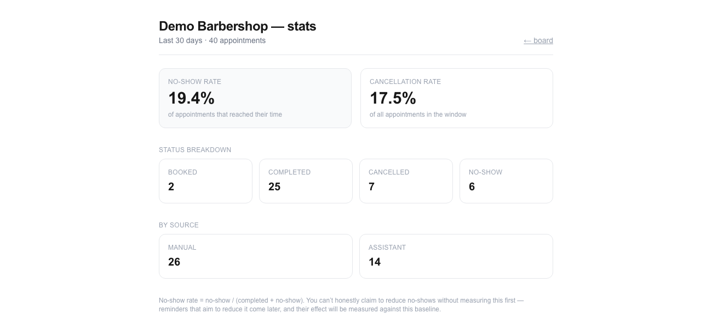

# deskbench

[](https://github.com/Volodymyr4K/deskbench/actions/workflows/ci.yml)

A front-desk assistant for small service businesses — built around one idea:
**before you ship "AI", measure whether you actually need it.**

deskbench handles the routine front-desk work of a salon, clinic, repair shop, or
barbershop — booking, rescheduling, cancellations, and no-show tracking. But the product is
not the bot. The product is the **discipline of
measuring where a large language model genuinely beats plain machine learning and
simple rule-based logic, and where it does not.**

> Most "AI receptionist" tools assume the LLM is the answer. deskbench treats that as a
> hypothesis to test, on real data, against cheaper baselines — and ships the LLM only
> where the numbers justify the cost.

A customer types a request in plain language; a `$0` rule-based parser turns it into a
bookable action — no LLM:



**Measured on a 109-example benchmark (full match — all four fields correct):**

| a 1.2B LLM | the `$0` rules | a 9B LLM | a 31B LLM |
|:----------:|:--------------:|:--------:|:---------:|
|   19.3%    |   **80.7%**    |  89.0%   |   94.5%   |

"AI" is a **downgrade until the model is big enough**: a small LLM loses badly to plain rules,
and it takes a ~9B+ model to beat them — at a latency + external-dependency cost the rules don't
have (~3 s/call vs ~0 ms, offline). A classical-ML baseline (Naive Bayes) lands at 79.8% intent,
also below the rules. The 31B LLM's win is statistically real at n=109 (its CI clears the rules').
**Measured, not assumed** — that's the whole point.

## Why this exists

The market is full of front-desk tools that staple an LLM onto a calendar and call it
intelligent. A lot of that work is solved just as well — and far more cheaply and
predictably — by classical ML or a few well-chosen rules. "AI" has become a marketing
reflex applied even where plain ML is plenty.

deskbench takes the opposite stance. Every automated capability starts with a simple
baseline (rules and/or classical ML). An LLM is introduced only when it is **measured**
to outperform that baseline on the same data — and where it loses or merely ties, the
simpler approach stays, and we say so out loud.

## What it does (target scope)

- **Booking** — clients request appointments; the system proposes open slots.
- **Reschedule / cancel** — handled conversationally, with the calendar as source of truth.
- **Reminders** *(not built — the no-show measurement below comes first)* — reduce no-shows
  via timely notifications.
- **Routine Q&A** — answer common client questions (hours, prices, location) without staff.
- **Operator view** — a simple, readable calendar for non-technical staff, not a CRM monster.

The operator board (per-staff appointments, day navigation, book/cancel/reschedule/no-show,
all in the business timezone):



A `/stats` view measures the business — starting with the no-show rate, because you can't
honestly claim to reduce no-shows without measuring them first:



## The measurement layer (the differentiator)

Each capability is benchmarked against simpler baselines on real dialogue data, scored on:

- **Accuracy** — did it understand and act on the request correctly?
- **Hallucinated-slot rate** — did it offer or book a time that wasn't actually free?
- **Cost per conversation** — real API cost of the LLM path vs. the cheaper baseline.

Comparisons are reproducible: fixed dataset, fixed prompts, a script anyone can re-run.
Honest conclusions over flattering ones — including where the LLM is not worth it.

### Measured results (not claimed)

`npm run eval` scores a parser on a curated 109-example benchmark
(`eval/dataset.json` — hand-written, not real customer logs) on four fields, a strict
"all four correct" rate, and per-intent precision/recall/F1 + an intent confusion matrix.

Current **rule baseline** (`$0`, ~0 ms, offline), committed in `eval/results/baseline.json`:

| field      | accuracy | 95% CI (Wilson) |
|------------|---------:|:----------------|
| intent     |   89.9%  | 82.8–94.3%      |
| service    |  100.0%  | 96.6–100.0%     |
| day        |   98.2%  | 93.6–99.5%      |
| time       |   91.7%  | 85.0–95.6%      |
| full match |   80.7%  | 72.3–87.0%      |

The intervals are wide because n is only 109 — that's the honest precision of these numbers,
not a rounding flex. Per-intent F1: BOOK 88.3 · CANCEL 93.3 · RESCHEDULE 97.1 · QUESTION 92.7 ·
UNKNOWN 80.0.
The confusion matrix shows exactly where it fails: **5 booking requests phrased without an
explicit verb or time** ("need a beard trim today", "haircut now") fall through to UNKNOWN,
which is why UNKNOWN's precision is only 66.7%. That's the point of measuring — it names the
gap instead of hiding it.

The baseline is **not** tuned to flatter these numbers. Since the benchmark was authored by
the same assistant, tuning the parser against its own visible misses would be overfitting
(there is no held-out split), so the honest baseline + "here's where it breaks" is kept as-is.

**Labels were cross-checked.** Two independent blind labelers (separate Sonnet subagents
given only the texts and the rubric, not the author's labels — see `eval/relabel/` and
`npx tsx eval/relabel/agree.ts`) reached 99.1% intent agreement and 93.6% full-record
agreement with the author. The disagreements caught 5 inconsistent author day-labels, which
were reconciled to the independent majority. This reduces single-author bias — though all
labelers are AI, not humans, so it is still not human ground truth.

**Classical ML baseline (rules vs ML).** `npm run eval:ml` trains a Multinomial Naive Bayes
intent classifier (TF unigrams + bigrams, no Python, deterministic) and scores it against the
rule baseline on the **same 5-fold held-out splits** (cross-validation — so this leg has a
proper train/test split). Result — intent accuracy:

| classifier            | intent accuracy (5-fold CV) | 95% CI (Wilson) |
|-----------------------|----------------------------:|:----------------|
| rule baseline         |                      89.9%  | 82.8–94.3%      |
| Naive Bayes (TF)      |                      79.8%  | 71.3–86.3%      |

The hand-written rules lead. NB over-predicts BOOK (it lacks the structural cues — like the
literal word "cancel" — that the rules encode). **Honest caveat: the two intervals overlap**,
so at n=109 this says "rules are at least as good as classical ML here," not a statistically
conclusive win — but it definitely gives no reason to prefer ML. So on this task classical ML
doesn't beat the `$0` rules, which is exactly the kind of result deskbench exists to surface:
the bar an LLM has to clear is the rules, not ML. Full numbers in `eval/results/ml-baseline.json`.

**LLM vs. rules across model sizes (full benchmark).**
`npm run eval -- --model <id> --concurrency 3` (needs `OPENAI_API_KEY`) scores any
OpenAI-compatible model on the same 109 examples. Three free models, smallest to largest
(`eval/results/llm-comparison.json`):

| parser                       | intent | service |  day  |  time | full match | per call |
|------------------------------|-------:|--------:|------:|------:|-----------:|---------:|
| rule baseline                |  89.9% |   100%  | 98.2% | 91.7% |   80.7%    |   ~0 ms  |
| LLM — Liquid LFM 1.2B (free) |  80.7% |   56.0% | 53.2% | 37.6% |   19.3%    |   <1 s   |
| LLM — Nemotron Nano 9B (free)|  98.2% |   99.1% | 93.6% | 98.2% |   89.0%    |   ~3 s   |
| LLM — Gemma 31B (free)       |  99.1% |   100%  | 95.4% |  100% |   94.5%    |   ~3 s   |

This is the whole thesis in one table — **model class decides whether "AI" is an upgrade or a
downgrade:**

- The **1.2B LLM is far worse than the `$0` rules** (19.3% vs 80.7% full match). It roughly gets
  intent but falls apart on structured extraction (service 56%, time 38%). Stapling a small LLM
  onto the calendar would be a regression, not a feature.
- It takes a **~9B model to beat the rules at all** (89.0%), and the 31B to win clearly (94.5%).
- Gemma's win **is real, not noise**: on intent its CI [95.0–99.8] clears the rules' [82.8–94.3],
  and on full match [88.5–97.5] vs [72.3–87.0] the intervals don't overlap at n=109.

So deskbench's answer here: a capable LLM *is* worth it on accuracy — but only a capable one,
and it buys that accuracy with latency (~3 s/call) and an external dependency the rules don't
have. It also isn't uniformly better — the rules still edge every model on date extraction
(98.2%), where a regex beats an LLM at "this evening" → null.

**Caveat that still stands:** the set is author-labeled, so on ambiguous items a model partly
scores for agreeing with the labeler — mitigated by the independent cross-check above, but not
eliminated (all labelers are AI).

## Tech stack

- **App:** Next.js (App Router), TypeScript
- **Data:** PostgreSQL
- **LLM:** OpenAI-compatible endpoint (OpenRouter by default; any compatible endpoint works)
- **Eval:** reproducible benchmark harness with baseline (rules / classical ML) vs. LLM

## Running locally

```bash
npm install
cp .env.example .env          # set DATABASE_URL (local Postgres)
npm run db:migrate            # create the schema
npm run db:seed               # demo barbershop, staff, services, appointments
npm run dev                   # operator board at http://localhost:3000
npm test                      # unit tests (availability, parser, resolver, dates)
npm run e2e                    # Playwright e2e (book / cancel / reschedule / intake) on an isolated test DB
```

On the board, the **quick intake** box turns a free-text request into a parsed intent and
an action — bookable slots for "combo friday at 2pm", matching appointments to drop for
"cancel my 3pm today", or a reschedule flow for "move my beard trim to friday" — all on the
rule-based parser, no LLM.

## Status

A working demo, not a shipped product — but the parts that exist are real, tested, and green
in CI. This README tracks the real state, not an aspirational one.

**Built & tested**

- Data model (Prisma/Postgres) with **DST-correct per-business timezone** — all wall-clock
  reasoning runs in `Business.timezone`; stored times are UTC instants (Luxon).
- Operator board: per-staff day view, day navigation, book / cancel / reschedule, client
  capture, mark completed / no-show.
- Free-text intake on a `$0` rule parser (`lib/parse/`): book / cancel / reschedule.
- `/stats`: no-show rate, cancellation rate, status breakdown, manual-vs-assistant source split.
- **Evaluation harness** (`eval/`): 109-example benchmark, independently cross-labeled; rule +
  classical-ML (Naive Bayes) + LLM parsers scored with per-intent precision/recall/F1, an
  intent confusion matrix, and Wilson 95% CIs; 5-fold held-out CV for the ML/rules comparison.
- Quality: **39 unit tests + 4 Playwright e2e**, green in GitHub Actions CI.

**Deliberately not built (and why)**

- **Reminders / notifications** — the no-show *measurement* comes first (you can't claim to
  reduce what you don't measure); the sending side needs scheduling infra and is out of scope
  for a demo.
- **Auth / multi-tenant isolation** — off-thesis here and the demo is single-operator; a real
  deployment needs it.
- Booking's overlap check is best-effort, not race-proof (no DB constraint / transaction).

**Honest caveats:** the benchmark is hand-authored (cross-checked by independent AI labelers,
but not human ground truth) and covers a single demo business.

**Optional next:** route intake through the LLM end-to-end to measure a hallucinated-slot rate
on full conversations.

## License

[MIT](LICENSE) © 2026 Volodymyr Kozachok
